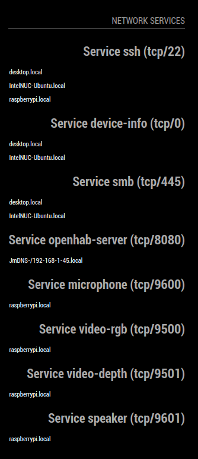

# MQTT Publisher

Module for [MagicMirror](https://github.com/MichMich/MagicMirror/) allows showing which services are online on your local network.

This module allows finding services you are interested in on your network, and can open then with the mmm-xdg-open module or some other mechanism.

*Note: 
Best used with [MMM-XDG-OPEN](https://github.com/cybex-dev/MMM-XDG-OPEN) to allow opening of any link from a service on your network* 

**Any issues, please report and pull requests are most welcome**

## Screenshot

Show is the header (defined in the config), and below a list of hosts on the local network providing a service, grouped by the type of service.

## Installation

Open up your terminal, navigate to `/path/to/MagicMirror/modules`. Then type in:

    git clone https://github.com/cybex-dev/MMM-ServiceViewer
    cd MMM-MQTT-Publisher
    npm install

## Configuration

Here is an example configuration with description. Put it in the `MagicMirror/config/config.js` file:

    {
        module: "MMM-ServiceViewer",
            header: "Network Services",
            position: "bottom_right",
            config: {
                // groupBy: "service",
                serviceTypes: [
                    "ssh", "device-info", "smb", "videodepth", "microphone", "openhab-server", "video-rgb", "video-depth", "speaker"
                ]
            }
        }
    }

`serviceTypes` is an array, so you can add the various services you are interested in (which is found on your local network).

## Configuration options

The following properties can be configured:

| Option             | Description
| ------------------ | -----------
| `position`         | Location on MagicMirror display
| `serviceTypes`      | An array of services you are interested in.

### OnClick functionality

When an host (entry) is clicked, a notification is sent using the [Magic Mirror Notification Mechanism](https://github.com/michMich/MagicMirror/wiki/notifications). The notification `XDG-OPEN` is sent along with details in the notification payload. The payload is defined as

    {
        protocol: "",
        location: "",
        port: "",
        type: "",
    } 

The payload descriptions/purpose is as follows

| Option             | Description
| ------------------ | -----------
| `protocol`         | Location on MagicMirror display
| `location`         | An array of services you are interested in.
| `port`             | An array of services you are interested in.
| `type`             | Type as defined in Avahi Service Types the first part of the service type e.g. the `_ssh` part of the full service name `_ssh._tcp`. The type name in this case will be `ssh` (without the underscore).  

*See the [Avahi Documentation](https://linux.die.net/man/5/avahi.service) and the [Arch Wiki](https://wiki.archlinux.org/index.php/Avahi) for information about Avahi operations and naming conventions, and the [IANA register](https://www.iana.org/assignments/service-names-port-numbers/service-names-port-numbers.xhtml) for service names and their corresponding ports.* 

## Collaborate

Pull requests are welcome.

## Future Work

- Improve GUI for viewing online/offline services with icons of services and status icons.
- Add browsing all services on the network, not just predefined services.
